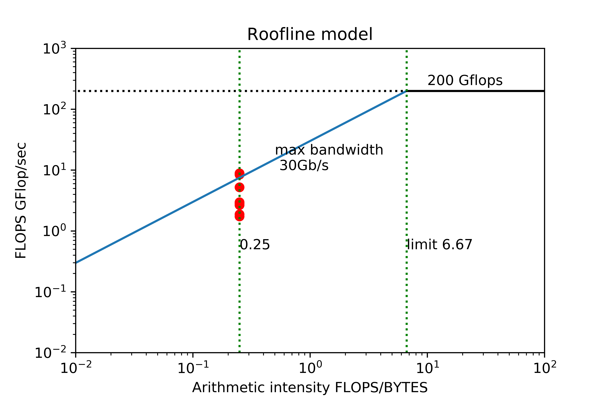

# LAB 1 report

## C1

N: 1000000  <T>: 0.001151 sec  B: 6.952704 GB/sec   F: 1738176020.325546 FLOP/sec

N: 300000000  <T>: 0.320165 sec  B: 7.496131 GB/sec   F: 1874032696.727758 FLOP/sec

or in GFLOP

N: 1000000  <T>: 0.000954 sec  B: 6.952704 GB/sec   F: 1.738176020325546 GFLOP/sec

N: 300000000  <T>: 0.324449 sec  B: 7.496131 GB/sec   F: 1.8740326967277579 GFLOP/sec

## C2

N: 1000000  <T>: 0.000384 sec  B: 20.813119 GB/sec   F: 5203279781.994832 FLOP/sec

N: 300000000  <T>: 0.202736 sec  B: 11.838081 GB/sec   F: 2959520144.874502 FLOP/sec

or in GFLOP

N: 1000000  <T>: 0.000386 sec  B: 20.813119 GB/sec   F: 5.203279781994832 GFLOP/sec

N: 300000000  <T>: 0.206004 sec  B: 11.838081 GB/sec   F: 2.959520144874502 GFLOP/sec

## C3

N: 1000000  <T>: 0.000226 sec  B: 35.398701 GB/sec   F: 8849675152.006639 FLOP/sec

N: 300000000  <T>: 0.212059 sec  B: 11.317583 GB/sec   F: 2829395673.163558 FLOP/sec

or in GFLOP

N: 1000000  <T>: 0.000383 sec  B: 20.861436 GB/sec   F: 8.84967515200664 GFLOP/sec

N: 300000000  <T>: 0.201840 sec  B: 11.890598 GB/sec   F: 2.829395673163558 GFLOP/sec

## C4

The program runs pretty slow when measuring this.

N: 1000000  <T>: 0.379161 sec  B: 0.021099 GB/sec   F: 5274802.597206 FLOP/sec

N: 300000000  <T>: 112.589222 sec  B: 0.021316 GB/sec   F: 5329106.917286 FLOP/sec

or in GFLOP

N: 1000000  <T>: 0.379161 sec  B: 0.021099 GB/sec   F: 0.005274802597206 GFLOP/sec

N: 300000000  <T>: 112.589222 sec  B: 0.021316 GB/sec   F: 0.005329106917286 GFLOP/sec

## C5

N: 1000000  <T>: 0.000237 sec  B: 33.745955 GB/sec   F: 8436488764.703528 FLOP/sec

N: 300000000  <T>: 0.225537 sec  B: 10.641275 GB/sec   F: 2660318783.746622 FLOP/sec

or in GFLOP

N: 1000000  <T>: 0.000237 sec  B: 33.745955 GB/sec   F: 8.436488764703528 GFLOP/sec

N: 300000000  <T>: 0.225537 sec  B: 10.641275 GB/sec   F: 2.660318783746622 GFLOP/sec

## Q1

The performance result of using second half is slightly better than using the whole loop. Data shows about 1 GB/sec improvement on FLOPs. And I believe the reason is about caching. In the first part, it is likely that many of data retrieved from memory is cached so that cache hit ratio is better in the second part.

## Q2

## Q3

C variant benchmark

| Variant     | N         | Bandwidth GB/s | FLOP Gflop/s       | Time (s) |
| ----------- | --------- | -------------- | ------------------ | -------- |
| simple loop | 1000000   | 6.952704       | 1.738176020325546  | 0.001151 |
| simple loop | 300000000 | 7.496131       | 1.8740326967277579 | 0.320165 |
| unroll      | 1000000   | 20.813119      | 5.203279781994832  | 0.000384 |
| unroll      | 300000000 | 11.838081      | 2.959520144874502  | 0.202736 |
| mkl-blas    | 1000000   | 35.398701      | 8.84967515200664   | 0.000226 |
| mkl-blas    | 300000000 | 11.317583      | 2.829395673163558  | 0.201840 |

Using simple loop with N=300000000 as baseline, we can conclude following major differences and findings.

1. Unrolling and mkl-blas can increase bandwidth and flops drastically. 

   The order of increasing is : simple loop < unroll < mkl-blas

2. With different N (small one and large one), for simple loop, bandwidth and flop are roughly stable and do not change much.

   But for unrolling and mkl-blas, bandwidth and flop drops with large N.

3. Mkl-blas performs best with smaller N , and with N increasing performance of unrolling and mkl-blas is roughly the same.

## Q4

**The result is surprisingly bad and error is quite obvious.**

| Variant     | N         | Expected dot product | Reality           |
| ----------- | --------- | -------------------- | ----------------- |
| simple loop | 1000000   | 1000000              | 1000000           |
| simple loop | 300000000 | 300000000            | 16777216          |
| unroll      | 1000000   | 1000000              | 1000000           |
| unroll      | 300000000 | 300000000            | 16777216          |
| mkl-blas    | 1000000   | 1000000              | 8.84967515200664  |
| mkl-blas    | 300000000 | 300000000            | 2.829395673163558 |

